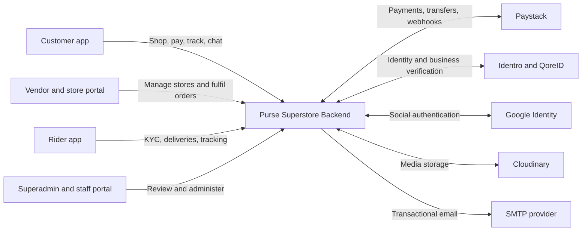
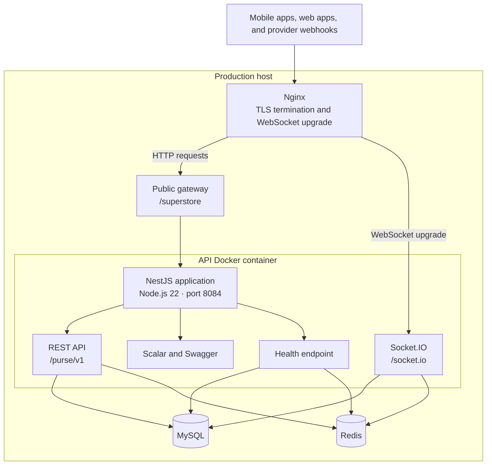
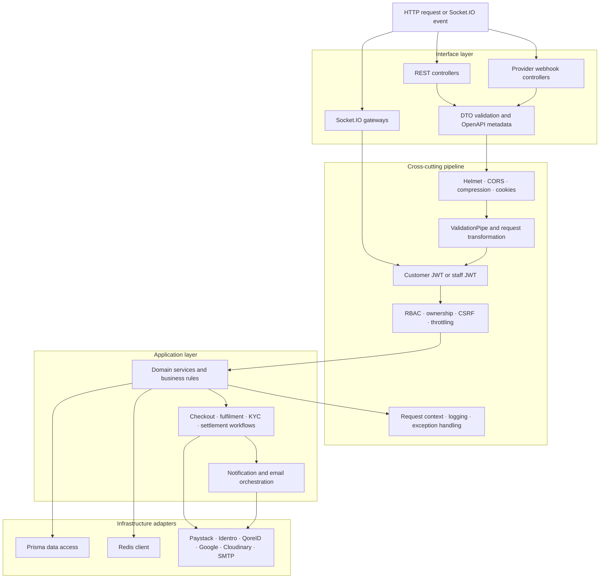
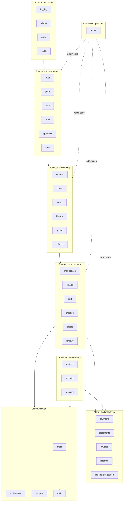
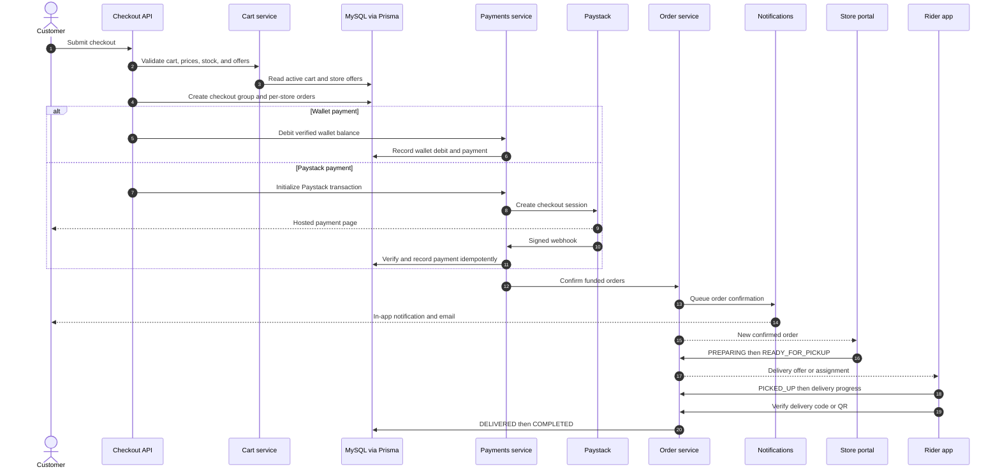
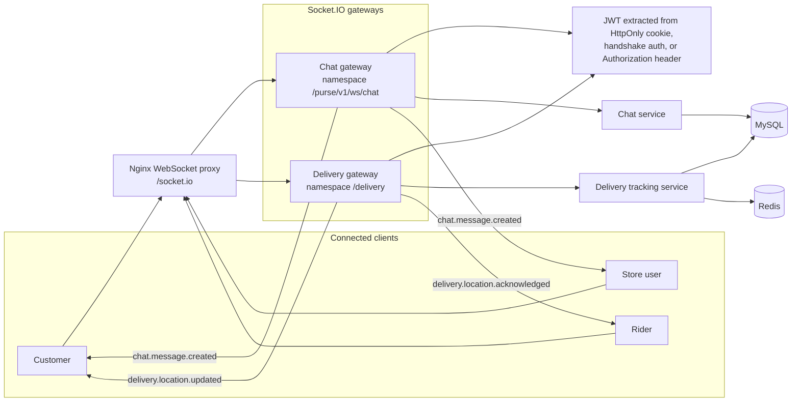
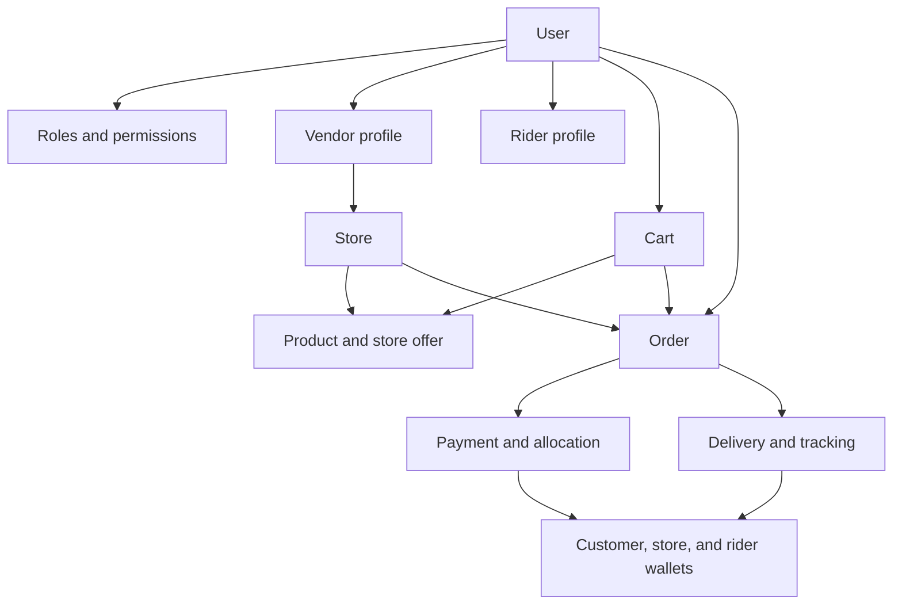

# Purse Superstore Backend Architecture

This document uses separate diagrams for separate concerns. Read them from top to bottom:

1. System context — who uses the platform and which external systems surround it.
2. Deployment containers — how traffic reaches the running services.
3. Application layers — how a request moves through the NestJS application.
4. Domain modules — how the source code is divided by business responsibility.
5. Core transaction flow — how checkout, payment, orders, and notifications interact.
6. Realtime flow — how chat and delivery tracking use Socket.IO.

## 1. System context

The backend is one application serving four role-specific client surfaces. Roles do not use separate databases.

## 2. Deployment containers

### Public addresses

| Surface             | Address                                |
| ------------------- | -------------------------------------- |
| Production gateway  | `https://api.syroltech.com/superstore` |
| Versioned REST API  | `/purse/v1/*`                          |
| Socket.IO transport | `/socket.io`                           |
| Health check        | `/purse/v1/health`                     |

## 3. NestJS application layers

### Responsibility rules

- Controllers and gateways translate transport input into service calls.
- DTOs live inside each module's `dto/` directory and own validation/OpenAPI metadata.
- Services own business rules and authorization-sensitive state changes.
- Prisma is the durable persistence boundary.
- Redis stores short-lived coordination data, cached provider tokens, and rate-limit state.
- Provider clients isolate external APIs from domain services.

## 4. Domain module map

### Important module dependencies

| Module          | Depends on                        | Reason                                                 |
| --------------- | --------------------------------- | ------------------------------------------------------ |
| `auth`          | Redis, RBAC, mail                 | Sessions, access calculation, OTP and account email    |
| `checkout`      | Cart, payments, notifications     | Validate cart, create payment intent, notify customer  |
| `orders`        | Checkout, cart, rewards           | Place orders, maintain timeline, issue rewards         |
| `payments`      | Cart, settlements, notifications  | Verify money movement and credit wallets/orders        |
| `delivery`      | Redis, notifications, settlements | Track active rides and release earnings                |
| `scanning`      | Settlements                       | Verify physical handoff before financial completion    |
| `riders`        | Identro, QoreID                   | KYC, liveness, licence, bank, and vehicle verification |
| `vendors`       | Identro, QoreID                   | Identity and business verification                     |
| `stores`        | QoreID                            | Store and CAC verification                             |
| `notifications` | Mail                              | In-app and email delivery preferences                  |

## 5. Checkout, payment, and fulfilment flow

### Order status ownership

| Stage                                                      | Owner                                      |
| ---------------------------------------------------------- | ------------------------------------------ |
| `ORDER_RECEIVED`                                           | Checkout system                            |
| `CONFIRMED`                                                | Payment verification system                |
| `PREPARING`, `READY_FOR_PICKUP`                            | Vendor or authorized store staff           |
| Assignment                                                 | Delivery workflow or authorized operations |
| `PICKED_UP`, `IN_TRANSIT`, `OUT_FOR_DELIVERY`, `DELIVERED` | Assigned rider                             |
| `COMPLETED`                                                | System after verified delivery             |
| Exceptional correction                                     | Authorized staff through an audited action |

## 6. Realtime architecture

REST and Socket.IO chat writes share the same persistence and broadcast contract. Delivery tracking persists accepted coordinates, uses Redis for rate coordination, and broadcasts only to authorized delivery rooms.

## 7. Data ownership

All roles share this relational model. Access is separated by authenticated identity, role and permission checks, resource ownership, and scoped queries rather than by separate databases.
