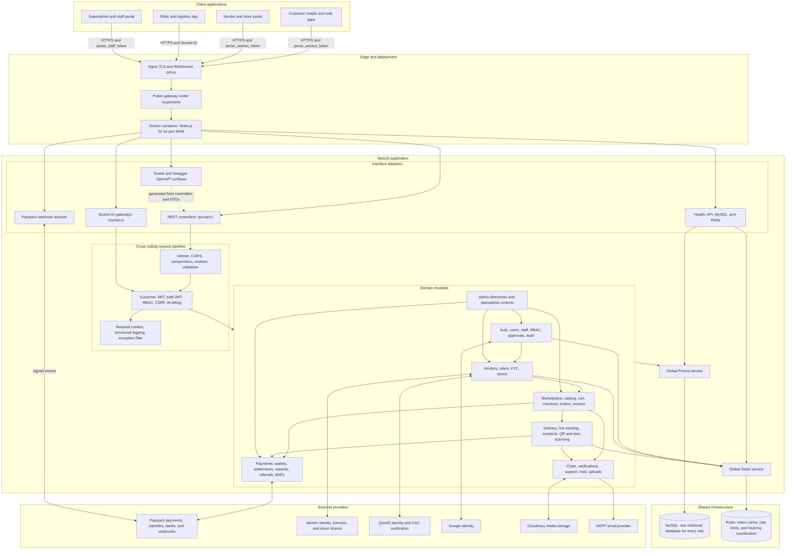
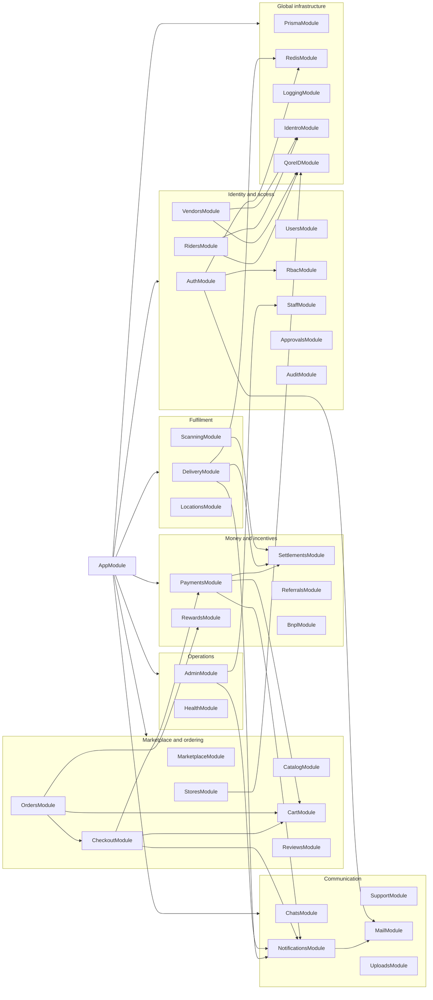

# Purse Superstore Backend Architecture

This file describes the deployed system, its NestJS module boundaries, shared infrastructure, realtime channels, and external providers. GitHub renders the Mermaid diagrams below directly.

## System architecture

## NestJS module dependencies

## Request lifecycle

1. Nginx terminates TLS and forwards application traffic through the public gateway.
2. NestJS applies transport middleware, DTO validation, authentication, authorization, CSRF protection, and rate limits.
3. Controllers delegate business rules to domain services.
4. Services use the global Prisma client for durable state and Redis for short-lived coordination or caching.
5. Payments, identity checks, uploads, and email are delegated to external providers.
6. Domain changes produce in-app notifications, email, or Socket.IO events where applicable.

## Authentication boundaries

- Customers, vendors, store agents, and riders use the `purse_access_token` HttpOnly cookie.
- Superadmins and back-office staff use the separate `purse_staff_token` HttpOnly cookie.
- Authorization is enforced by backend roles, granular permissions, ownership checks, and audited operational actions.
- Socket.IO accepts the customer access token through the cookie, handshake auth field, or Authorization header. Query-string tokens are rejected.

## Data ownership

The platform uses one MySQL database. Customers, vendors, store agents, riders, and staff are separated through relational ownership, roles, permissions, and scoped queries rather than separate databases.

## Realtime channels

| Capability          | Socket.IO path | Namespace           | Main rooms/events                                                      |
| ------------------- | -------------- | ------------------- | ---------------------------------------------------------------------- |
| Delivery tracking   | `/socket.io`   | `/delivery`         | Delivery rooms, location updates, acknowledgements, and status updates |
| Customer/store chat | `/socket.io`   | `/purse/v1/ws/chat` | `chat:join`, `chat:message`, and `chat.message.created`                |

## Deployment model

The production image is built in three stages: dependency installation, TypeScript/Prisma compilation, and a minimal Node.js runtime. The entrypoint can apply committed Prisma migrations before starting `dist/main.js`. MySQL and Redis are external runtime dependencies, while the API listens on port `8084` inside the container.
