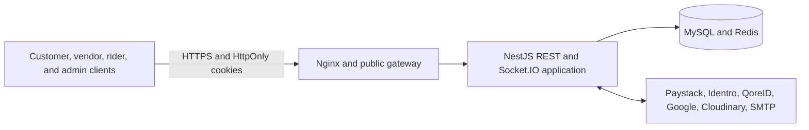

# Purse Superstore API

Production-oriented NestJS backend for a multi-role marketplace serving customers, vendors, store agents, motorcycle riders, and back-office staff.

The API covers authentication, marketplace discovery, multi-store checkout, Paystack payments, wallets, order fulfilment, rider delivery tracking, QR verification, rewards, support, chat, KYC, notifications, and audited administration.

## Architecture

The complete system and module dependency diagrams are available in [ARCHITECTURE.md](ARCHITECTURE.md).



## Technology stack

- Node.js 22
- NestJS 11 and TypeScript 5.9
- Prisma 7 with the MariaDB adapter and MySQL
- Redis through ioredis
- Socket.IO for chat and live delivery tracking
- Paystack for card payments, bank transfers, bank lookup, and account resolution
- Identro and QoreID for identity, CAC, liveness, and driver-licence workflows
- Cloudinary for media uploads
- Nodemailer and SMTP for transactional email
- Scalar and Swagger generated from one OpenAPI contract
- Jest for unit and contract tests

## API addresses

Production gateway:

```text
https://api.syroltech.com/superstore
```

Versioned API base:

```text
https://api.syroltech.com/superstore/purse/v1
```

Health check:

```text
GET https://api.syroltech.com/superstore/purse/v1/health
```

Interactive API references:

| Audience             | Scalar                                                     | Swagger                                                        |
| -------------------- | ---------------------------------------------------------- | -------------------------------------------------------------- |
| Customer and public  | [Scalar](https://api.syroltech.com/superstore/docs/public) | [Swagger](https://api.syroltech.com/superstore/swagger/public) |
| Vendor and store     | [Scalar](https://api.syroltech.com/superstore/docs/store)  | [Swagger](https://api.syroltech.com/superstore/swagger/store)  |
| Rider and logistics  | [Scalar](https://api.syroltech.com/superstore/docs/rider)  | [Swagger](https://api.syroltech.com/superstore/swagger/rider)  |
| Superadmin and staff | [Scalar](https://api.syroltech.com/superstore/docs/admin)  | [Swagger](https://api.syroltech.com/superstore/swagger/admin)  |

## Authentication and authorization

The application uses secure HttpOnly cookies:

- `purse_access_token` for customers, vendors, store agents, and riders.
- `purse_staff_token` for superadmins and back-office staff.

Clients must enable credential handling with `credentials: "include"` or Axios `withCredentials: true`. Access and refresh tokens are not returned for storage in browser JavaScript.

Authorization is enforced by:

- Platform roles and granular permissions.
- Ownership checks for stores, orders, conversations, deliveries, and wallets.
- Separate staff authentication and role restrictions.
- Audited administrative actions and approval workflows.
- CSRF protection, request throttling, DTO validation, and origin restrictions.

## Role surfaces

### Customer

- Registration, email verification, login, Google authentication, and password recovery.
- Marketplace, catalog, product search, barcode lookup, and offer comparison.
- Cart, checkout, pickup or delivery, Paystack payment, and wallet funding.
- Orders, tracking, returns, QR delivery verification, rewards, referrals, reviews, support, and store chat.

### Vendor and store agent

- Vendor KYC and store registration.
- Store profile, CAC verification, catalog offers, inventory, pricing, orders, campaigns, riders, inbox, settings, and wallet operations.
- Packing scans, fulfilment status updates, and rider handoff QR generation.

### Rider and logistics

- Progressive rider onboarding and KYC.
- Automatic identity, liveness, and Nigerian driver-licence verification.
- Motorcycle, registration, payout account, and conditional evidence management.
- Delivery offers, pickup scans, live location tracking, delivery verification, earnings, withdrawals, inbox, and settings.

### Superadmin and staff

- Separate staff login and permissions.
- Customer, order, payout, store, rider, vendor, and campaign directories.
- KYC reviews, operational corrections, approvals, support operations, rewards administration, audit records, and announcements.

## Main modules

```text
src/
├── admin/          Administrative operations and directories
├── approvals/      Sensitive-action approval workflows
├── audit/          Audited activity records
├── auth/           Customer and role authentication
├── bnpl/           BNPL integration boundary; rollout currently paused
├── cart/           Cart and coupon management
├── catalog/        Categories, products, offers, and barcode lookup
├── chats/          REST and Socket.IO customer/store chat
├── checkout/       Multi-store checkout and pickup settings
├── common/         Guards, decorators, interceptors, and shared DTOs
├── delivery/       Rider assignment, delivery state, and live tracking
├── health/         API, MySQL, and Redis health reporting
├── identro/        Identro identity-provider client
├── locations/      Geographic reference data
├── logging/        Structured logging and request context
├── mail/           Transactional email and templates
├── marketplace/    Customer marketplace aggregation
├── notifications/  In-app notification delivery and preferences
├── orders/         Orders, timelines, returns, and status ownership
├── payments/       Paystack, wallet funding, withdrawals, and webhooks
├── prisma/         Shared Prisma client
├── qoreid/         QoreID identity-provider client
├── rbac/           Roles and granular permissions
├── redis/          Shared Redis client
├── referrals/      Referral rewards
├── reviews/        Verified-purchase reviews
├── rewards/        Cashback, vouchers, and reward accounts
├── riders/         Rider KYC, vehicles, licences, banks, and earnings
├── scanning/       Order QR and item scan workflows
├── settlements/    Store settlement and rider earning calculations
├── staff/          Staff authentication and administration
├── stores/         Store management, inventory, campaigns, and wallets
├── support/        Customer support tickets and FAQs
├── uploads/        Cloudinary uploads
├── users/          Profiles and addresses
└── vendors/        Vendor onboarding and verification
```

DTO classes are kept inside each module's `dto/` directory. Controllers handle transport concerns, services contain business rules, and Prisma is the durable persistence boundary.

## Important workflows

### Checkout and payment

```text
catalog → cart → checkout validation → per-store orders
        → wallet or Paystack payment → verified payment
        → order confirmation notification → fulfilment
```

Wallet credits and payment confirmations are server-owned. Paystack webhooks are signature-verified and processed idempotently.

### Order fulfilment

```text
ORDER_RECEIVED → CONFIRMED → PREPARING → READY_FOR_PICKUP
               → PICKED_UP → IN_TRANSIT / OUT_FOR_DELIVERY
               → DELIVERED → COMPLETED
```

Status ownership is enforced by role: the system confirms payment, store staff prepare orders, assigned riders progress delivery, and exceptional staff actions are audited.

### Rider KYC

```text
profile → identity → liveness → driver licence verification
        → motorcycle and registration evidence → submission
        → staff review → approval or reasoned rejection → retry when corrected
```

### Realtime communication

Socket.IO is served through `/socket.io`.

| Capability          | Namespace           | Important events                                                                     |
| ------------------- | ------------------- | ------------------------------------------------------------------------------------ |
| Delivery tracking   | `/delivery`         | Join/leave delivery, location input, location update, acknowledgement, status update |
| Customer/store chat | `/purse/v1/ws/chat` | `chat:join`, `chat:message`, `chat.message.created`                                  |

REST-created chat messages and Socket.IO-created messages broadcast the same `chat.message.created` event.

## Database model

All roles use one MySQL database. Separation is implemented through user roles, staff identities, ownership relations, permissions, and scoped database queries—not separate databases.

Prisma migrations are committed under `prisma/migrations`. Production deployments must use `prisma migrate deploy`; do not use `prisma db push` against production.

## Local development

### Prerequisites

- Node.js 22 or newer
- MySQL 8-compatible server
- Redis 7-compatible server
- Provider credentials for the integrations being exercised

### Installation

```bash
npm install
cp .env.example .env
npm run prisma:generate
npm run prisma:migrate:dev -- --name local_setup
npm run prisma:seed
npm run start:dev
```

On PowerShell, replace the copy command with:

```powershell
Copy-Item .env.example .env
```

With the application default port, the local versioned API is:

```text
http://localhost:3000/purse/v1
```

The Docker deployment sets `PORT=8084`.

## Environment configuration

Copy `.env.example` and configure the relevant values. Major groups include:

- Application: `NODE_ENV`, `PORT`, `BASE_URL`, and `CORS_ORIGIN`.
- Persistence: `DATABASE_URL` and `REDIS_URL`.
- Authentication: JWT secrets, cookie policy, OTP policy, and Google client ID.
- Payments: Paystack secret/public keys, callback URL, and settlement rates.
- Identity: Identro and QoreID credentials and approval policies.
- Media: Cloudinary credentials.
- Email: SMTP credentials and sender address.
- Operations: logging, migration-on-start, and delivery tracking limits.

Never commit real credentials or production secrets.

## Quality checks

```bash
npm run prisma:validate
npm run validate:migrations
npm run format:check
npm run lint
npm run build
npm test
npm run test:e2e
```

The combined local verification command is:

```bash
npm run check
```

## Docker build

```bash
npm run docker:build
```

The multi-stage Dockerfile generates Prisma Client, compiles NestJS, removes development dependencies, and starts the production build through `docker-entrypoint.sh`. Set `RUN_PRISMA_MIGRATIONS_ON_START=true` only when the deployment process should apply committed migrations before startup.

## Health and operations

`GET /purse/v1/health` checks both MySQL and Redis. It returns `200` when required dependencies are healthy and `503` when either dependency is unavailable.

Production reverse proxies and uptime monitors must probe the full health path rather than `/`.

## License

This repository is private and unlicensed for redistribution.
